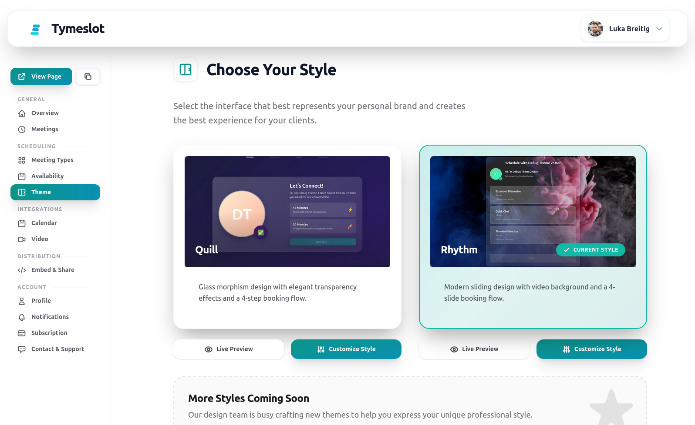
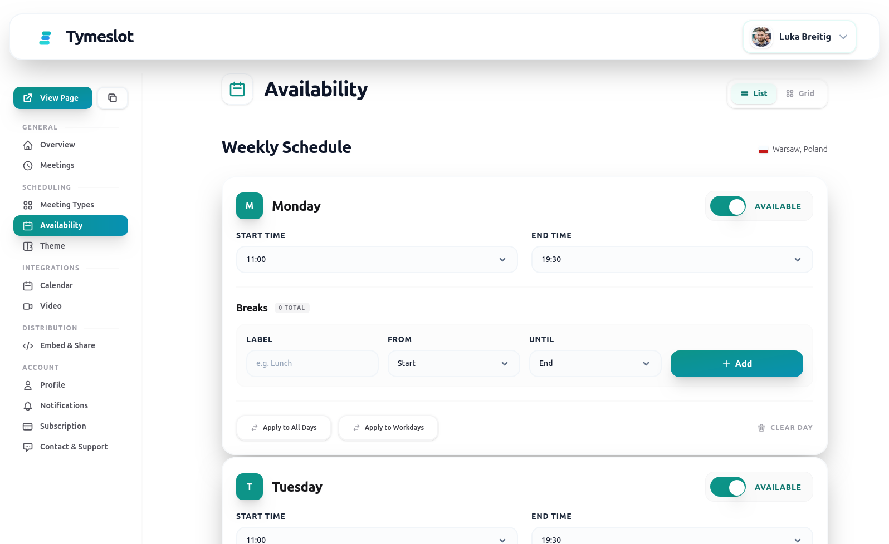
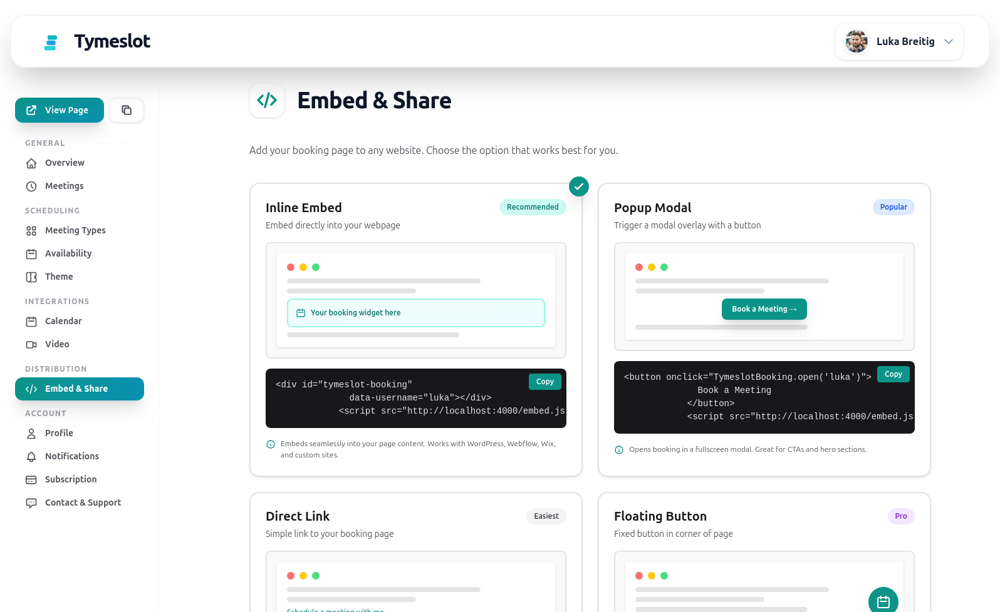

**The Open-Source Alternative to Calendly**

Enterprise-grade meeting scheduling platform built with Elixir & Phoenix LiveView

[🚀 Try Cloud Version](https://tymeslot.app) · [📖 Documentation](https://github.com/tymeslot/tymeslot/wiki) · [🐛 Report Bug](https://github.com/tymeslot/tymeslot/issues)

---

## 🎯 Why Choose Tymeslot?

<table>
<tr>
<td width="33%" align="center">

### 🔓 Truly Open Source
Fork, audit, contribute—or just use it. No vendor lock-in, ever.

</td>
<td width="33%" align="center">

### 🏠 Your Data, Your Rules
Self-host on Docker/Cloudron or use our managed cloud.

</td>
<td width="33%" align="center">

### 🆓 Full-Featured Free Tier
Everything you need to get started. Forever. No credit card required.

</td>
</tr>
<tr>
<td width="33%" align="center">

### 🔒 Privacy-First
No tracking pixels, no data mining, no selling your data.

</td>
<td width="33%" align="center">

### 🎨 Professional Templates
Responsive email designs with calendar attachments.

</td>
<td width="33%" align="center">

### ⚡ Built for Performance
Real-time updates with Phoenix LiveView. Blazing fast.

</td>
</tr>
</table>

## 🔌 Integrations

### Calendar Providers (5)

  
  &nbsp;&nbsp;
  
  &nbsp;&nbsp;
  
  &nbsp;&nbsp;
  
  &nbsp;&nbsp;
  

### Video Conferencing (5)

  
  &nbsp;&nbsp;
  
  &nbsp;&nbsp;
  
  &nbsp;&nbsp;
  
  &nbsp;&nbsp;
  

## 💰 Simple, Transparent Pricing

<table>
<tr>
<td width="50%">

### 🆓 Free Forever
**Self-Hosted or Cloud**

- ✅ Unlimited bookings & meeting types
- ✅ All 5 calendar providers
- ✅ All 5 video platforms
- ✅ Multi-language (EN, DE, UK)
- ✅ Webhooks & embedding
- ✅ Advanced reminders
- ✅ Community support

**Perfect for:** Individuals, small teams, self-hosters

</td>
<td width="50%">

### ⭐ Pro Tier
**€5/month · Cloud Only**

- ✅ **Everything in Free**
- ✅ **Priority support**
- ✅ **Support open-source development**
- ✅ **Early access to new features**

**Perfect for:** Professional businesses, agencies

[Get Started →](https://tymeslot.app)

</td>
</tr>
</table>

> **Self-Hosting**: Always free. Deploy on Docker, Cloudron, or bare metal—no licensing fees, ever.

## ✨ Feature Highlights

<table>
<tr>
<td>

### 🔐 Authentication & Users
- Multi-provider OAuth (Google, GitHub)
- Email/password with verification
- Customizable profiles & avatars
- 4-step onboarding flow

</td>
<td>

### 🧠 Smart Scheduling
- 90+ timezone-aware cities
- Custom business hours & breaks
- Real-time conflict detection
- Configurable meeting types

</td>
<td>

### 📅 Calendar Sync
- 5 calendar providers
- Full CRUD operations
- Auto token refresh
- Calendar discovery

</td>
</tr>
<tr>
<td>

### 🎥 Video Conferencing
- 5 video providers
- Auto room creation
- Role-based access
- OAuth integration

</td>
<td>

### 📧 Email System
- Professional templates (MJML)
- 5 notification types
- Calendar attachments
- Delivery tracking

</td>
<td>

### 🔒 Security
- Rate limiting
- AES encryption
- XSS protection
- Circuit breakers

</td>
</tr>
<tr>
<td>

### 🌍 Internationalization
- 3 languages (EN, DE, UK)
- Auto browser detection
- Localized booking pages
- DST handling

</td>
<td>

### 🔗 Embedding
- Secure iframe widgets
- Domain restrictions
- Webhook notifications
- Customizable pages

</td>
<td>

### ⏰ Reminders
- Unlimited per meeting
- Flexible timing
- Email notifications
- Automatic retry

</td>
</tr>
</table>

## 📸 Screenshots

| Dashboard & Management | Availability & Scheduling | Embedded Booking Widget |
|:---:|:---:|:---:|
|  |  |  |

## 🆚 Tymeslot vs Calendly

| Feature | Tymeslot | Calendly |
|---------|----------|----------|
| **Open Source** | ✅ Yes | ❌ No |
| **Self-Hosting** | ✅ Free Forever | ❌ Not Available |
| **Data Privacy** | ✅ Your Infrastructure | ❌ Their Servers |
| **Unlimited Bookings** | ✅ Free Tier | ❌ Paid Only |
| **Calendar Providers** | 5 Providers | 3 Providers |
| **Video Providers** | 5 Providers | 3 Providers |
| **Multi-Language** | ✅ 3 Languages | ✅ Multiple |
| **Webhooks** | ✅ Free Tier | ❌ Paid Only |
| **Embedding** | ✅ Free Tier | ✅ Available |

## 💼 Perfect For

<table>
<tr>
<td width="33%">

### 👨‍💼 Freelancers & Consultants
Replace endless email chains with professional booking pages

</td>
<td width="33%">

### 🏢 Small Businesses
Coordinate team availability without enterprise pricing

</td>
<td width="33%">

### 🔒 Privacy-Conscious Orgs
Keep scheduling data on your own infrastructure

</td>
</tr>
<tr>
<td width="33%">

### 🌍 International Teams
Multi-language support for global customer bases

</td>
<td width="33%">

### 💻 Developers & Tech Teams
Extensible platform with webhook integrations

</td>
<td width="33%">

### 📖 Open Source Projects
Embed booking widgets in your documentation

</td>
</tr>
</table>

## 🛠️ Built With

**Backend:** Elixir 1.19 · Phoenix 1.8 · Phoenix LiveView 1.1 · Oban
**Database:** PostgreSQL 14+ · Ecto SQL
**Frontend:** Tailwind CSS · ESBuild · Alpine.js
**Email:** Swoosh · MJML Templates
**Infrastructure:** Docker · Cloudron Ready

## 🚀 Getting Started

<table>
<tr>
<td width="25%" align="center">

### ☁️ Cloud
[Try Now →](https://tymeslot.app)

Zero setup
Start in 60 seconds

</td>
<td width="25%" align="center">

### 🐳 Docker
[Guide →](README-Docker.md)

Self-hosting
Full control

</td>
<td width="25%" align="center">

### 📦 Cloudron
[Guide →](README-Cloudron.md)

One-click install
Managed platform

</td>
<td width="25%" align="center">

### 💻 Development
[Docs →](CONTRIBUTING.md)

Local setup
Contribute code

</td>
</tr>
</table>

## 🤝 Contributing

<table>
<tr>
<td width="25%" align="center">

### ⭐ Star
[Star Repo →](https://github.com/tymeslot/tymeslot/stargazers)

Help others discover Tymeslot

</td>
<td width="25%" align="center">

### 💰 Support
[Subscribe →](https://tymeslot.app)

Fund open-source development

</td>
<td width="25%" align="center">

### 🐛 Report
[Open Issue →](https://github.com/tymeslot/tymeslot/issues)

Bugs & feature requests

</td>
<td width="25%" align="center">

### 💻 Code
[Guidelines →](CONTRIBUTING.md)

Development setup & PR process

</td>
</tr>
</table>

## 🛡️ Security

<table>
<tr>
<td width="50%">

**Built-in Protection**
- ✅ Input sanitization & XSS protection
- ✅ AES encryption for credentials
- ✅ Rate limiting & IP protection
- ✅ Security headers (CSP, HSTS, CSRF)
- ✅ Regular dependency updates

</td>
<td width="50%">

**Report Vulnerabilities**

Use our [contact page](https://tymeslot.app/contact) for security issues.

**Documentation**
- [Docker Deployment](README-Docker.md)
- [Cloudron Deployment](README-Cloudron.md)
- [Contributing Guide](CONTRIBUTING.md)

</td>
</tr>
</table>

## 📄 License

This project is licensed under the Elastic License 2.0 - see the [LICENSE](LICENSE) file for details.

## 🏢 About

Tymeslot is developed by:
- **Luka Karsten Breitig**
- **Diletta Luna OÜ**
- Sepapaja 6, 15551 Tallinn, Estonia

## 💬 Community & Support

- 💬 [Join Discussions](https://github.com/tymeslot/tymeslot/discussions) - Get help from the community
- 🐛 [Report Bugs](https://github.com/tymeslot/tymeslot/issues) - Help us improve
- 💡 [Request Features](https://github.com/tymeslot/tymeslot/issues) - Share your ideas
- 📧 [Contact Us](https://tymeslot.app/contact) - Business inquiries
- ⭐ [Star on GitHub](https://github.com/tymeslot/tymeslot/stargazers) - Show your support

---

**Built with ❤️ using Elixir, Phoenix, and LiveView**

Made by [Luka Karsten Breitig](https://github.com/tymeslot) · [Diletta Luna OÜ](https://tymeslot.app) · Tallinn, Estonia

